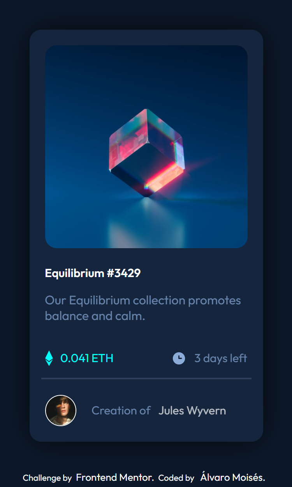
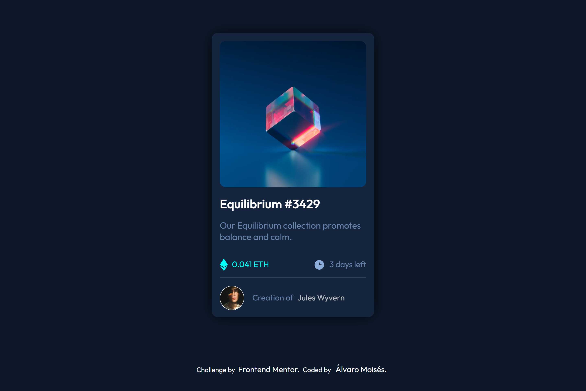

# Frontend Mentor - NFT preview card component solution

This is a solution to the [NFT preview card component challenge on Frontend Mentor](https://www.frontendmentor.io/challenges/nft-preview-card-component-SbdUL_w0U). Frontend Mentor challenges help you improve your coding skills by building realistic projects. 

## Table of contents

- [Overview](#overview)
  - [The challenge](#the-challenge)
  - [Screenshot](#screenshot)
  - [Links](#links)
- [My process](#my-process)
  - [Built with](#built-with)
  - [What I learned](#what-i-learned)
  - [Continued development](#continued-development)
  - [Useful resources](#useful-resources)
- [Author](#author)

## Overview
this is my solution for another challenge from Frontend Mentor page, is a great website for praciticing and also have some resources for learn front end development, so if you´re interested check it out.

the challenge this time, was build a NFT card image, with some interactive effects, also it´s a newbie entry challenge.

this time  i used:

-SASS as CSS preprocersor for the styling.

-PUG as HTML preprocersor for the HTML markup.

### The challenge

Users should be able to:

- View the optimal layout depending on their device's screen size
- See hover states for interactive elements

### Screenshot

mobile view:

desktop view:

### Links

- Solution URL: [git-hub repository](https://github.com/Alvaro-Moises-Gonzalez/Frontend-Mentor-NFT-card-challenge)
- Live Site URL: [git-hub pages](https://your-live-site-url.com)

## My process
I started building the HTML markup using pug, creating various containers, one for the card, the card itself is a container that wraps the images and the rest of the info.

the images were a tricky ones, first i created a div to be the cyan and  eye icon container. i set the position of this one to absolute and positioning it over the cube image, the make its visibility to hidden, then with a hover effect on the image container i set the visibility of the div to visible again.

for the rest of the info i used a h1 tag for the title and a p tag for the description, then i used a hr tag for the bottom line.

the autor and its info have a container then i change its display to flex, to use some flexbox propertys. i nested a p element on figcaption for the styling and later hover efect.

finally make the hover effect for the image, title and author name, for some iteractivity like change colors.

i tried to use more semantic html for better accesibility.
### Built with

- Semantic HTML5 markup
- CSS custom properties
- Flexbox
- CSS Grid
- Mobile-first workflow
- PUG
- SASS

### What I learned

i learned a lot this time, first to think about wrappers and parent containers, because some positioning require better markup to make some thing easier, also think about accesibility tags and its functions like, figure and figcaption that i started to use on this challenge.

BEM its a good choice to name css class, but i need a lot practice, so i´ll practicing with it more

### Continued development

i stuggled a lot with the image´s effect, i tried make it with :after psedoelement, but i failed i have to think for another way to fufill the chalenge. so i´ll practicing more pseudolements and some images effects, on that way i´ll have more tools to play with css

## Author

- Website - [Alvaro Gonzalez](https://github.com/Alvaro-Moises-Gonzalez)
- Frontend Mentor - [@Alvaro-Moises-Gonzalez](https://www.frontendmentor.io/profile/Alvaro-Moises-Gonzalez)

